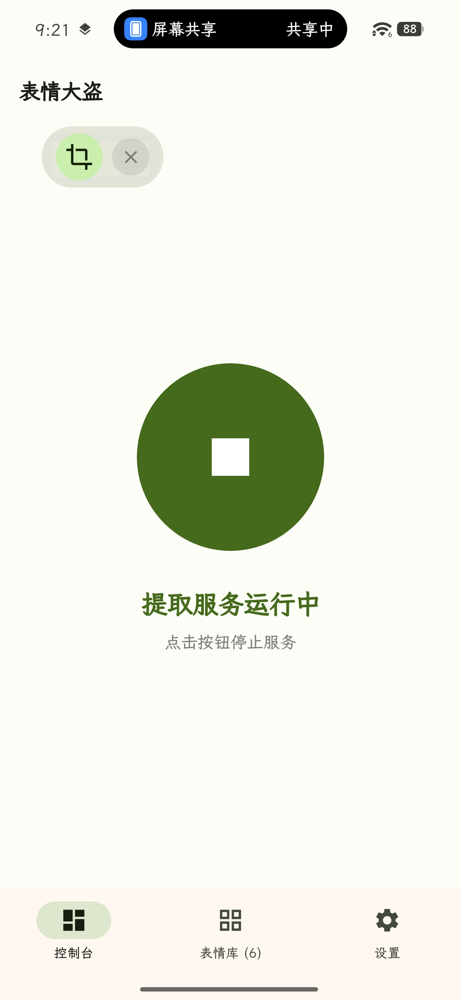
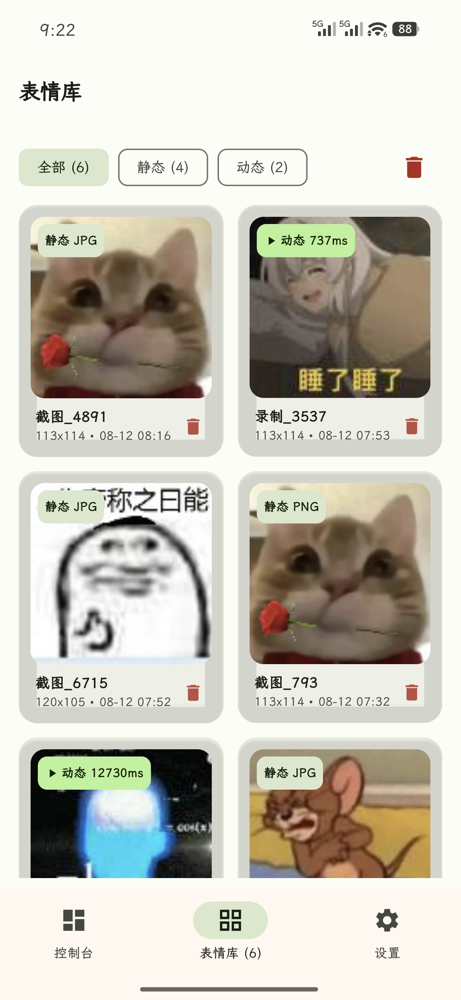

<h1>表情大盗</h1>

> [!CAUTION]  
> #### 🔔 如有一般性问题请前往 [Discussions](https://github.com/darkmatter2048/MemeCapture/discussions) 讨论区，***Issues*** 仅用于错误报告和功能请求。

> [!tip]
> #### 🧱 从 [中国大陆地区下载](https://pan.quark.cn/s/eda5e9363a48) 最新版 MemeCapture

## 软件界面

| 首页 | 表情库 |
|:---:|:---:|
|  |  |

## 使用教程

- 1.启动服务
- 2.跳转到微信或QQ
- 3.部分机型需要点击超级岛然后允许屏幕共享
- 4.后点击表情直到进入只有表情和纯色背景的表情聚焦页面
- 5.点击悬浮窗的捕获按钮，按钮会消失，按钮再次出现即为捕获完成(动态表情需手动结束录制)

>[!tip]
>
>[视频教程](app/src/main/res/raw/tutorial.mp4)(测试机型号:小米 17 T Pro)

## 贡献者

## 鸣谢

非常感谢以下个人和企业对本项目的支持 ❤️

<table>
  <tr>
    <td></td>
    <td>非常感谢 <a href="https://www.qiaoxh.com/?from=dyblog.online">乔星欢</a> 为 dyblog.online 提供的免费 CDN 服务 (<a href="https://www.devpole.com/?from=dyblog.online">DevPole</a>) ❤️</td>
  </tr>
</table>

## Star History

<a href="https://www.star-history.com/?repos=darkmatter2048%2FMemeCapture&type=date&legend=top-left">
 <picture>
   <source media="(prefers-color-scheme: dark)" srcset="https://api.star-history.com/chart?repos=darkmatter2048/MemeCapture&type=date&theme=dark&legend=top-left&sealed_token=mzumJ7jyoEe6azzvricxAfyUCE-VXx6EqqPCu7TMrhDcUfOxSBwaB9qfcaY7yaOW09yTo7QjDMS-3tAqSxfcYfB7DXrB6SO6MUb0f0TeyZkMEg-AaSBxwQ" />
   <source media="(prefers-color-scheme: light)" srcset="https://api.star-history.com/chart?repos=darkmatter2048/MemeCapture&type=date&legend=top-left&sealed_token=mzumJ7jyoEe6azzvricxAfyUCE-VXx6EqqPCu7TMrhDcUfOxSBwaB9qfcaY7yaOW09yTo7QjDMS-3tAqSxfcYfB7DXrB6SO6MUb0f0TeyZkMEg-AaSBxwQ" />
   
 </picture>
</a>

## Copyright & License ⚖

Copyright © 2021-2026 DaYe

<a property="dct:title" rel="cc:attributionURL" href="#">MemeCapture</a> by <a rel="cc:attributionURL dct:creator" property="cc:attributionName" href="https://www.dyblog.online/">DaYe</a> is licensed under <a href="https://creativecommons.org/licenses/by-nc-sa/4.0/?ref=chooser-v1" target="_blank" rel="license noopener noreferrer" style="display:inline-block;">CC BY-NC-SA 4.0</a>

